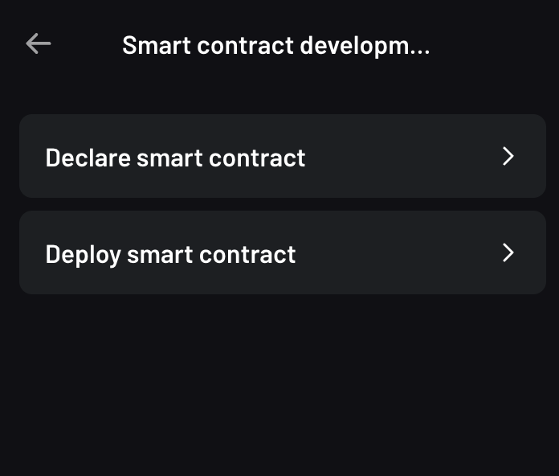
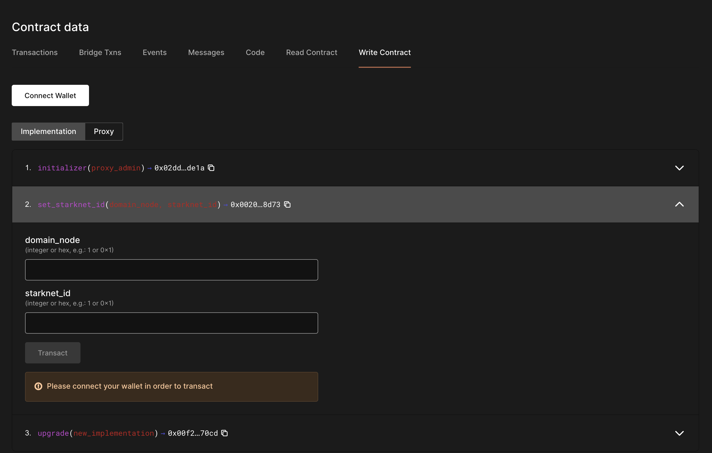

# How to upgrade your Cairo 0 contracts to Cairo 1 using `replace_class`

## Why upgrade to Cairo 1.0 ?

With Regenesis approaching on Starknet, Cairo 0.x will soon be deprecated in favour of Cairo 1. To ensure your contracts continue working after Regenesis, it's important to migrate them from Cairo 0.x to Cairo 1. As Starknet Alpha v0.11.0 is now live on Mainnet, Cairo 1 contracts can now deployed and current Cairo 0 contracts can now be upgraded with provided `replaced_class` syscall without necessitating a change in contract address.

## Upgrading your Upgradable Cairo 0.x contracts to Cairo 1

In Cairo 0.x, in order to have an upgradable Cairo 0.x contracts, you will often utilize a `Proxy` contract with a `set_implementation` function that allows the contract owner to upgrade 


The method that we will be covering utilizes the `replace_class` syscall to remove the need for a proxy pattern altogether. At the end of migration the contract utlizes an implementation class hash  with an upgrade method in it. This method assumes that the `replace_call` syscall will not be deprecated and the Proxy pattern in cairo0 will not be the dominant pattern for upgradeable contracts in cairo1.

Before proceeding with the tutorial, make sure you have the following dependencies installed.

```bash
cairo-lang v0.11.0
cairo v1.0.0-alpha.6
protostar
```

You can install `cairo-lang` with `pip`. We are using protostar but it is optional and can be replaced with any other similar tooling that you might prefer.

The code for the contracts used in this article is available at https://github.com/NethermindEth/0to1CairoDemo. Feel free to follow along!

### Building and deploying the Cairo 0 contracts

Let's start off by building the required Cairo 0 contracts.

```shell
cd cairo0
protostar build
```

Declare both the `proxy` and the `cairo0resolver` that's built in the previous step.

```shell
protostar declare ./build/proxy.json \
    --account-address $ACCOUNT_ADDRESS --max-fee auto \
    --private-key-path=../private --network testnet

protostar declare ./build/cairo0resolver.json \
    --account-address $ACCOUNT_ADDRESS  --max-fee auto \
    --private-key-path=../private --network testnet
```

Here, the `$ACCOUNT_ADDRESS` is the address of your wallet, and `./private` is the file containing your private key.

<!-- ```shell
starknet declare --contract build/proxy.json --account version_11_2
starknet declare --contract build/cairo0resolver.json --account version_11_2
``` -->

<!-- class hash 0xeafb0413e759430def79539db681f8a4eb98cf4196fe457077d694c6aeeb82
transaction hash for declaration above 0x6d72968648f4feab7776ac644137f7008b9b113980169c99fe90a3656852b54 -->

If for some reason declare doesnt work from CLI, you can try ArgentX wallet's developer settings under `Settings -> Developer settings -> Smart contract development`, which provides a GUI for declaring your contract.



<!-- class hash 0x6cf18bc8305c6b2ce6d1954cf9a502fbd8fe4aac467bd89fb0682de4c077e6c
transaction hash for declaration above 0xe23e6ba05b95cc4e1836b08a64f107d16c2966f9b9343442dc33cf08410d70 -->

Finally, we deploy an implementation of the declared classes on chain via `protostar deploy`, which calls a UDC to deploy our contracts.

```shell
protostar deploy $PROXY_CLASS_HASH \
--account-address $ACCOUNT_ADDRESS \
-n testnet --max-fee auto --private-key-path ./private \
--wait-for-acceptance \
-i $CAIRO0_RESOLVER_CLASS_HASH \
0x2dd76e7ad84dbed81c314ffe5e7a7cacfb8f4836f01af4e913f275f89a3de1a 1 \
$ACCOUNT_ADDRESS
```

This deploys the Proxy contract and calls the `initializer` with the desired class hash to proxy to, which in this case would be the our `cairo0resolver` class.

The inputs provided via the `-i` flag specifies the class hash for the `cairo0resolver`, the selector for the `initializer` function, the length of the calldata, and wallet the address of the proxy admin respectively.


<!-- Some values used in the CLI below

selector for 'initializer'  0x2dd76e7ad84dbed81c314ffe5e7a7cacfb8f4836f01af4e913f275f89a3de1a 

proxy declare at 0xeafb0413e759430def79539db681f8a4eb98cf4196fe457077d694c6aeeb82 

UDC address 0x041a78e741e5af2fec34b695679bc6891742439f7afb8484ecd7766661ad02bf

implementation class hash for cairo0resolver 0x6cf18bc8305c6b2ce6d1954cf9a502fbd8fe4aac467bd89fb0682de4c077e6c

working account address 0x1c15b60bc80306354cc68d83c1fc487b4b0b0e1540fe62c1df9aa3ae4ba396a -->


<!-- ```shell
starknet invoke \
    --address 0x041a78e741e5af2fec34b695679bc6891742439f7afb8484ecd7766661ad02bf \
    --abi ../UDC.json \
    --function deployContract \
    --inputs 0xeafb0413e759430def79539db681f8a4eb98cf4196fe457077d694c6aeeb82 0 0 4 0x6cf18bc8305c6b2ce6d1954cf9a502fbd8fe4aac467bd89fb0682de4c077e6c 0x2dd76e7ad84dbed81c314ffe5e7a7cacfb8f4836f01af4e913f275f89a3de1a 1 0x1c15b60bc80306354cc68d83c1fc487b4b0b0e1540fe62c1df9aa3ae4ba396a \
	--account version_11_2
``` -->

<!-- transaction hash for above transaction 0x33017a6d35867256b06b34d4f4604e577dbe85c403b036617e13b1655c2c51
contract deployed at 0x000684167f946c40e4fe022e8af0bd6d17a18b04d0a0bed7826fecb891648222 -->


### Upgrading your contract

Before we perform the upgrade, let's perform some state changes on the contract. We can do this via invoking a the `set_starknet_id` function on the contract which will update the `resolver` variable to the specified value. You can do this either via `protostar invoke` or just using the Voyager provided function call interface.

```shell
protostar invoke \
    --contract-address $PROXY_CONTRACT_ADDRESS \
    --function set_starknet_id \
    --inputs 10 2024 \
    --max-fee auto --private-key-path ../private \
    --network testnet --account-address $ACCOUNT_ADDRESS
```

In voyager, you can invoke the function by going to https://goerli.voyager.online/contract/{CONTRACT_ADDRESS}#writeContract, where `CONTRACT_ADDRESS` should be replaced by the proxy contract address.



After the transaction is accepted, the state should be updated successfully.

Next, let's prepare to upgrade our contract. As most Cairo tooling are still adding support to Cairo 1, we will be using the binaries from the Cairo repo directly as well as utilize the Starknet Cli.

You can reuse the account you used for the deployment of your previous contracts with protostar by editing your starknet account config, which usually resides in `~/.starknet_accounts`.

```json
{
    "alpha-goerli": {
        "account_v11": {
            "private_key": "${WALLET_PRIVATE_KEY}",
            "address": "${WALLET_ADDRESS}",
            "deployed": true
        }
    }
}
```

As usual, build your Cairo contracts, but this time using the binaries from `Cairo v1.0.0-alpha.6`.

```json
starknet-compile ./cairo1/cairo1resolver.cairo ./cairo1/cairo1resolver.json --replace-ids
```

Now, we can start declaring our Cairo 1 contract on chain.

```shell
starknet declare --contract ./cairo1resolver.json --account account_v11
```

If you have any issue declaring your Cairo 1 contract, you can check out [our article] on deploying your first Cairo 1 contract, which covers some of the problems you might face.

<!-- transaction hash for above transaction 0x3c490dc2a84ab9259b0c732b663b51106d31e868580681008b1a6d7749ad457

compile cairo1/cairo1resolver.cairo via cairo1 compiler and please add the steps for compiling etc here
class hash after declaration for cairo1/cairo1resolver.cairo 0x1d7ec1927b0bab67fdaea523906077c6f141eb68ca0e7b8c6403705d67fb1cb -->

Finally, we can now perform an upgrade via the proxy to the new Cairo 1 implementation.

```bash
starknet invoke \
    --address $PROXY_CONTRACT_ADDRESS \
    --abi ./cairo0/build/cairo0resolver_abi.json \
    --function upgrade \
    --inputs $CAIRO_1_RESOLVER_CLASS_HASH \
        --account account_v11
```		
		
<!-- transaction hash 0x31ee06c302cc24719350ae248d31610478d6b0831804cd5bb27cec21fec16a3 -->

After the transaction is accepted by L2, you can now check if the implementation has been updated and the state is in tact as well to confirm that the update is successful! The proxy should now point to your Cairo 1 class and reading `resolver` should return you the same state as before without issues!

With this, you have successfully upgraded your Cairo 0.x implementation to Cairo 1!

## Upgradable Cairo 1 contract

With the `replace_class` syscall, it is now possible to remove the need for a Proxy altogether. Now, to upgrade your contract, you can call the `upgrade` function which will call `replace_class` to replace the current class of your implementation with the provided class, effectively performing an upgrade.

Our `cairo1resolver` class already implemented an `upgrade` function that utilizes `replace_class` for this. If you haven't implemented something like this yet, you might need to perform a upgrade for your proxy again to a class with this function implemented. It will look something like this:

```rust
#[external]
fn upgrade(new_class_hash: core::starknet::class_hash::ClassHash) ->felt252 {
    replace_class_syscall(new_class_hash);
    1
}
```

Let's now proceed with calling the above `upgrade` function:

```shell
starknet invoke \
    --address $PROXY_CONTRACT_ADDRESS \
    --function upgrade \
    --inputs $CAIRO_1_RESOLVER_CLASS_HASH \
    --account account_v11
```

After the transaction is accepted, you should now see that your proxy contract has been changed to a regular contract with an implementation class of `cairo1resolver`!
<!-- 
after the above transaction is completed the contract at 0x000684167f946c40e4fe022e8af0bd6d17a18b04d0a0bed7826fecb891648222 has been changed from a proxy/implementation type to regular contract with an implementation class of 0x1d7ec1927b0bab67fdaea523906077c6f141eb68ca0e7b8c6403705d67fb1cb

transaction hash for above transaction 0x2d61b7f4b21d0ece5ba4f3abaa87d730112a7b33e19df2ec06e12b77b4db284 -->

<!-- Final sentence -->
With this, you now have a Cairo 1 contract that is upgradable as well!